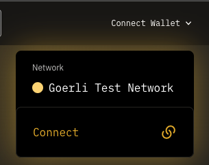

# View Fractal

The Fractal app is available at [app.fractalframework.xyz](https://app.fractalframework.xyz).

Fractal is built on Ethereum Virtual Machine (EVM) networks, including the testnet Goerli and (coming June 2023) Ethereum Mainnet.

There is no need to connect an Ethereum account to view DAOs, their proposals, or Safe treasuries on Fractal, however for the full experience of voting, creating templates, and managing your DAO's governance, you will need an Ethereum wallet.

The most common browser-based web3 wallet is MetaMask, which you can [learn more about here](https://learn.metamask.io/lessons/what-is-a-crypto-wallet).

# Find a Fractal DAO

Use the search bar in the upper left of the app to search for specific DAOs.

Enter the Ethereum address of the Fractal DAO that you want to interact with. If the DAO exists, it will appear as a result.


You may also search for and view any existing Safe wallet on Fractal.


# Connect Wallet

Click the `Connect Wallet` dropdown menu in the upper right corner of the app and again click `Connect`.

Select your installed wallet plugin from the available options to connect your wallet with Fractal.  Once connected, you should see your wallet address or ENS name and avatar in the upper right corner of the app.

Now that you are connected, Fractal will display your full range of options for any given DAO that you are a signer or token holder for.