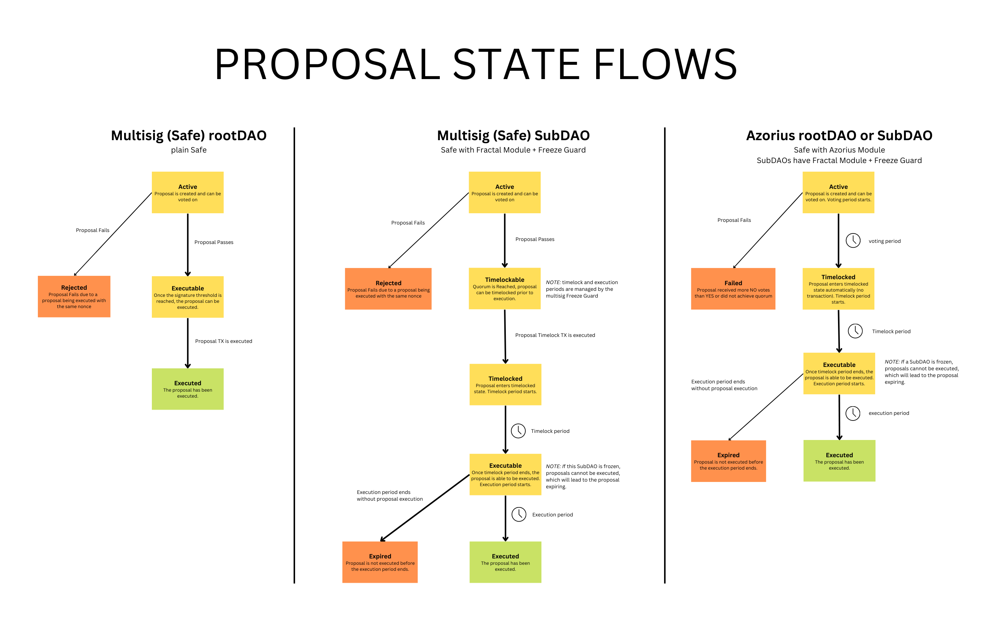

# rootDAO Proposal Lifecycle

## Overview

#### Active
As soon as the proposal has been created, the voting period starts, and any wallet that has DAO voting tokens allocated to it can vote on the proposal. Once the voting period ends, votes can no longer be cast.

#### Timelocked
Once a proposal has been approved, the timelock period begins.
The proposal cannot be executed until the timelock period ends.

#### Executable
Once the Timelock period ends, the proposal becomes Executable. A proposal can be executed by anyone.

A proposal is only executable during the execution period, which begins when the proposal enters the Executable state. 

#### Executed
After a proposal is executed, the transactions on the proposal are executed and the proposal enters the **Executed** state.

#### Expired
If the execution period expires before the proposal is executed, the proposal will enter the **Expired** state and will no longer be able to be executed.

#### Failed
If the majority of token holders voted No, or quorum is not reached within the voting period, the proposal enters the **Failed** state.